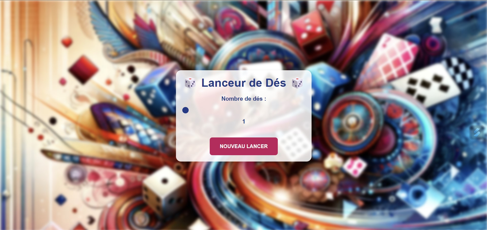
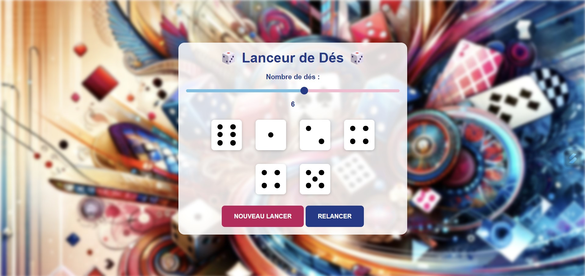
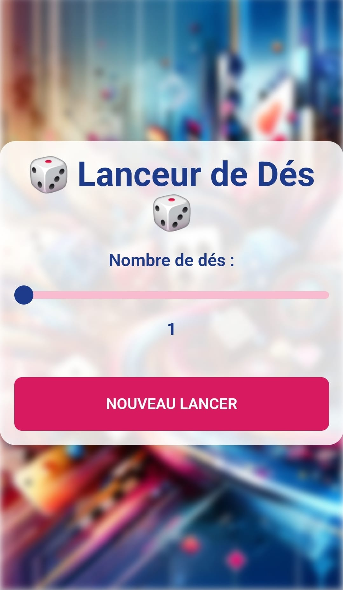
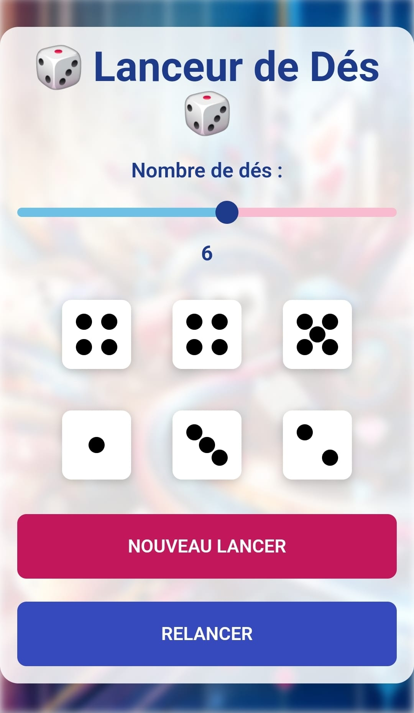

# 🎲 Lanceur de Dés 🎲

 

## 📜 Présentation

Bienvenue dans le Lanceur de Dés, une application web simple et amusante qui vous permet de lancer de 1 à 10 dés en un seul clic. Que vous soyez en train de jouer à un jeu de société, de résoudre un problème mathématique ou que vous ayez simplement envie de lancer quelques dés pour le plaisir, cette application est là pour vous !   

 

Avec une interface épurée et moderne, ce lanceur de dés offre une expérience fluide et agréable sur tous vos appareils, qu'ils soient mobiles ou desktop.   

 
 

## ✨ Fonctionnalités Principales

🎛️ Sélection du nombre de dés : Choisissez de lancer entre 1 et 10 dés grâce à un curseur intuitif et dynamique   
🎲 Animation réaliste des dés : Les dés tournent et s'animent pour simuler un vrai lancer   
🌀 Design moderne et responsive : Une interface soignée qui s’adapte à tous les écrans   
🌈 Curseur dynamique : Le curseur affiche une jauge colorée pour indiquer le nombre de dés sélectionnés   
🔄 Relancer facilement : Un bouton "Relancer" apparaît pour lancer à nouveau les mêmes dés, ou revenir à l’étape de sélection avec "Nouveau Lancer"   

## 📸 Aperçu

Voici à quoi ressemble l'application :   

   

   

   

   

 
 

[Démo vidéo du projet sur ordinateur 🎥](https://www.youtube.com/watch?v=lZ337uMTsiQ)

[Démo vidéo du projet sur mobile 🎥](https://www.youtube.com/watch?v=UxYJJX_ytHQ)

 
 

## 🌐 Lien direct

Pour l'utiliser : [Lanceur de Dés 🎲](https://gabriellepagnard.github.io/Dice_roller/
)   

 
 

## 🔧 Technologies Utilisées

⚙️ HTML5 : Structure du jeu
🎨 CSS3 & TailwindCSS : Styles, animations et design responsive
💻 JavaScript (ES6+) : Logique du jeu, interactions et dynamique des cartes

 
 

## 📂 Fichiers du Projet

- index.html : Structure de la page web   
- style.css : Fichier de styles pour personnaliser l'apparence   
- app.js : Script JavaScript pour gérer l'interactivité   
- ressources/ : Dossier contenant l'image de fond,le favicon et les screenshots   

 
 

## 🛠️ Installation et Utilisation

Pour démarrer avec Lanceur de dés, suivez ces étapes simples :   

➡️ Clonez le Répertoire :   

`git clone https://github.com/votre-utilisateur/lanceur-de-des.git`   

➡️ Accédez au Répertoire :   

`cd lanceur-de-des`   

➡️ Ouvrez le Fichier "index.html" dans votre navigateur pour voir l'application en action   

➡️ Personnalisez le Code selon vos besoins ou apportez des contributions !   

 
 

## 🏗️ Comment Contribuer

Vous souhaitez contribuer ? 🎉 Voici comment faire :   

### Créer une Branche 🌿

➡️ Pour chaque nouvelle fonctionnalité ou correction, créez une nouvelle branche :   

`git checkout -b nom-de-la-branche`   

### Faire vos Changements ✏️   

Apportez les modifications nécessaires et committez-les :   

`git add .`   
`git commit -m "Description des changements"`   

### Pousser les Changements ⬆️   

Envoyez vos modifications à GitHub 📨 :

`git push origin nom-de-la-branche`   

### Créer une Pull Request 🔄   

Allez sur GitHub, ouvrez une Pull Request et expliquez vos modifications   

 
 

## 🤝 Contributeurs/trices

Gabrielle Pagnard 🧑‍💻 - Créatrice du projet

 
 

## 📬 Contact

Pour toute question ou suggestion, n'hésitez pas à me contacter :   

Email : gpagnard@gmail.com   
GitHub : [GabriellePagnard](https://github.com/GabriellePagnard)     

 
 
 

Merci infiniment de vous être intéressé à ce projet ! 🙌   
Si vous avez aimé l'application ou si vous la trouvez utile, n'hésitez pas à laisser une étoile ⭐ sur GitHub. Votre soutien aide à faire connaître ce projet et motive à continuer à l'améliorer !

 
 

Ensemble, faisons tourner les dés et le fun ! 🎲💥   